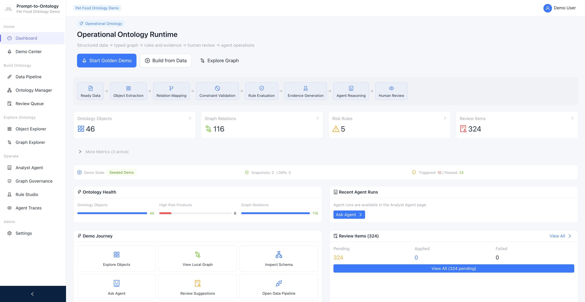
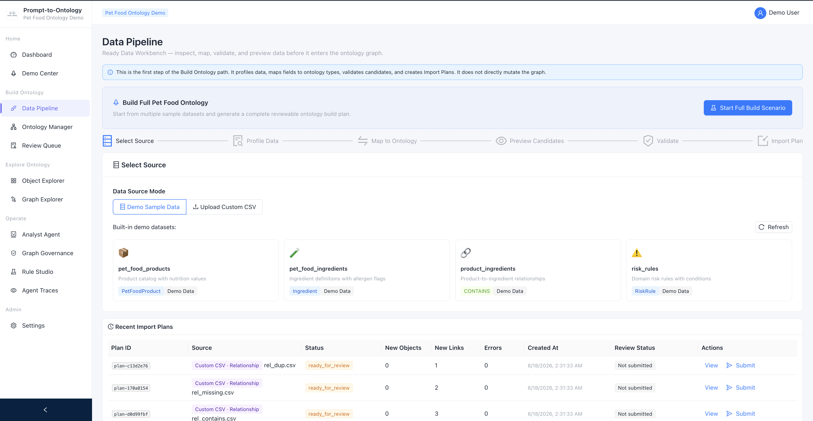
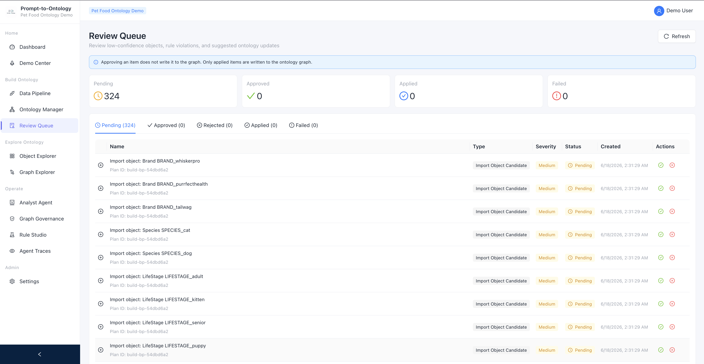
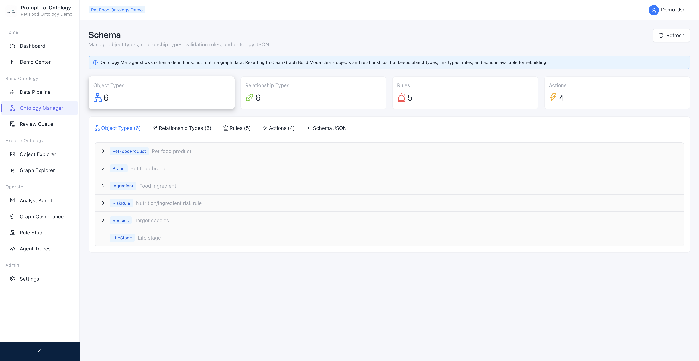
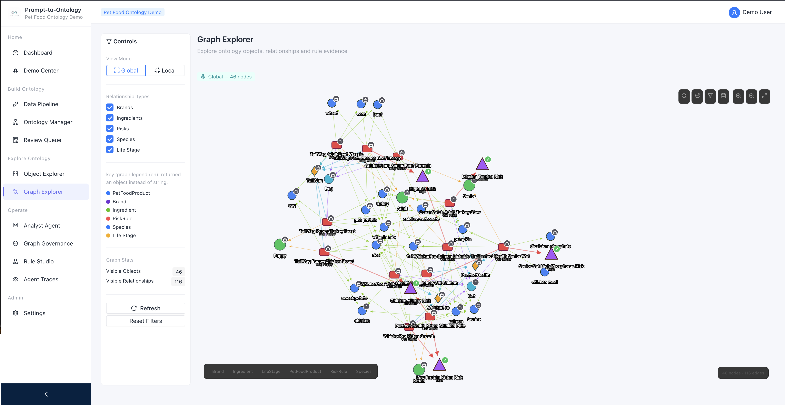
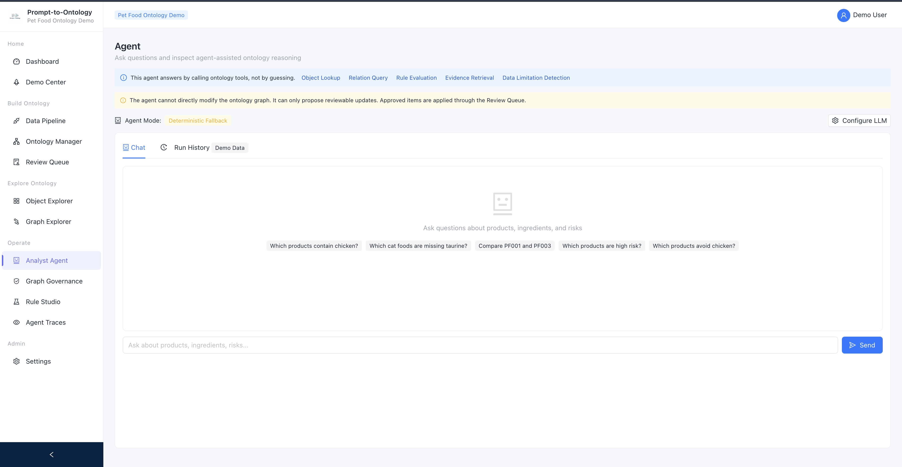

# Prompt-to-Ontology

> An open-source, domain-agnostic operational ontology runtime that turns structured data into typed graphs, rules, evidence, reviewable updates, and agent operations.

**Status:** Feature-complete reference implementation · Maintenance and bug fixes


<p align="center">
  
</p>

---

## What This Is

Prompt-to-Ontology is a domain-agnostic operational ontology runtime. It ingests structured CSV data, builds a graph of typed objects and relationships, evaluates rules against that graph, generates evidence edges, and supports an ontology-grounded Analyst Agent — all with human-in-the-loop review at every step.

The runtime covers the full lifecycle: structured data ingestion through a profiled Data Pipeline, typed ontology construction via Import Plans and Review Queue, rule evaluation and evidence generation in Rule Studio, agent reasoning through tool-calling with deterministic fallback, structured Agent Trace and evaluation, and graph governance with snapshot, diff, and rollback.

Pet Food is the built-in demonstration domain, not the product itself. The same engine can be pointed at any domain schema — food safety, supply chain, compliance — without changing the runtime code.

---

## Why It Matters

- **Fragmented business meaning.** A typed ontology gives structure to objects, relationships, and rules.
- **Hidden rules.** Explicit rule definitions with 4-state evaluation make logic inspectable and simulatable.
- **Unverifiable agent answers.** The Analyst Agent operates through ontology tools and produces traceable evidence edges.
- **Unreviewed model suggestions.** Every proposed update passes through the Review Queue before touching the graph.
- **Untraceable graph changes.** Graph Governance provides snapshot, diff, and rollback.

---

## Core Principles

- Domain-agnostic runtime — the engine is not tied to Pet Food or any specific industry
- Schema-first modeling — object types, link types, constraints, rules, and actions are declared in YAML
- Rules produce explicit evidence — 4-state evaluation (triggered / passed / not_evaluable / not_applicable)
- Agents operate through ontology tools — not free-form text generation
- Suggestions require human review — no autonomous graph modification
- Graph changes remain traceable and reversible — snapshots, diffs, and rollback

---

## Product Architecture


---

## Product Walkthrough

### Data Pipeline and Review Queue

<table>
  <tr>
    <td width="50%" valign="top">
      
      <br>
      <strong>Data Pipeline</strong><br>
      Profile structured data, map fields to ontology types, validate candidates, and generate a reviewable import plan.
    </td>
    <td width="50%" valign="top">
      
      <br>
      <strong>Review Queue</strong><br>
      Approve, reject, and apply proposed ontology changes through a human-in-the-loop workflow.
    </td>
  </tr>
</table>

### Ontology Definition and Runtime Graph

<table>
  <tr>
    <td width="50%" valign="top">
      
      <br>
      <strong>Ontology Manager</strong><br>
      Inspect object types, relationship types, rules, actions, constraints, and schema definitions.
    </td>
    <td width="50%" valign="top">
      
      <br>
      <strong>Graph Explorer</strong><br>
      Explore runtime objects, relationships, rule evidence, and global or local graph views.
    </td>
  </tr>
</table>

### Analyst Agent

<p align="center">
  
</p>

The Analyst Agent answers through ontology tools rather than free-form guessing. It can retrieve objects, query relationships, evaluate rules, inspect evidence, detect data limitations, and propose reviewable updates. The Analyst Agent cannot directly modify the graph — all suggestions pass through the Review Queue.

---

## Demo Video

[](https://youtu.be/XG8USHbZ3oM)

The video walks through data ingestion, ontology construction, human review, graph exploration, rule evaluation, and Analyst Agent operations.

---

## Quick Start

### Docker Compose (Recommended)

```bash
git clone https://github.com/wenhaoyu-bryan/Prompt-to-Ontology.git
cd Prompt-to-Ontology
cp .env.example .env
docker compose up --build
```

| Service | URL |
|---|---|
| Frontend | http://localhost:5173 |
| Backend API | http://localhost:8765 |
| Neo4j Browser | http://localhost:7474 |

Default login: `demo` / `demo`

<details>
<summary>Manual Development</summary>

#### Prerequisites

- Docker (for Neo4j)
- Python 3.10+
- Node.js 18+

#### 1. Start Neo4j

```bash
docker run -d --name neo4j-ontology \
  -p 7474:7474 -p 7687:7687 \
  -e NEO4J_AUTH=neo4j/ \
  neo4j:5
```

#### 2. Start Backend

```bash
cd backend
pip install -r requirements.txt
uvicorn main:app --host 0.0.0.0 --port 8765 --reload
```

Pet food sample data is auto-imported on first startup.

#### 3. Start Frontend

```bash
cd frontend
npm install
npm run dev
```

Open http://localhost:5173.

</details>

---

## Guided Demo

**Dashboard → Demo Center → Start Golden Demo**

Quick Demo steps:

1. **Dashboard** — overview of runtime state
2. **Data Pipeline** — profile sample CSV, review mappings, generate import plan
3. **Review Queue** — review candidates, approve or reject, apply to graph
4. **Object Explorer** — browse products, inspect evidence and risk edges
5. **Graph Explorer** — explore the local and global evidence network
6. **Rule Studio** — review rule definitions, coverage, and run simulations
7. **Analyst Agent** — ask natural-language questions, propose reviewable updates
8. **Agent Trace** — inspect structured traces and 5-score evaluations
9. **Graph Governance** — create a snapshot, view diff, test rollback

---

## Feature Matrix

| Feature | Status | Description |
|---|---|---|
| Ontology Manager | ✅ Available | Object types, link types, rules, actions, constraints |
| Data Pipeline | ✅ Available | Profile, map, validate, generate import plans |
| Custom Object CSV | ✅ Available | Upload object CSV with type inference |
| Relationship CSV | ✅ Available | Upload relationship CSV with validation |
| Review Queue | ✅ Available | Human-in-the-loop approve / reject / apply |
| Object Explorer | ✅ Available | Browse and inspect runtime objects |
| Graph Explorer | ✅ Available | Global and local graph views with D3 |
| Rule Studio | ✅ Available | Rule definitions, coverage, simulation |
| Analyst Agent | ✅ Available | Tool-calling agent with deterministic fallback |
| Agent Trace and Evaluation | ✅ Available | Structured traces, 5-score evaluation |
| Graph Governance | ✅ Available | Snapshot, diff, rollback |
| Demo Center | ✅ Available | Guided step-by-step demo experience |
| Docker Compose | ✅ Available | One-command local setup |
| English and Chinese UI | ✅ Available | 400+ translation keys via i18next |

---

## LLM Configuration

The Analyst Agent works in **deterministic fallback mode** by default — no external LLM API key is required. The demo runs without any LLM configuration.

To enable LLM-powered reasoning:

1. Copy `backend/.env.example` to `backend/.env` and set your API key, **or**
2. Configure at runtime via the UI: **Settings → LLM Config**

**Supported providers:** OpenAI, Anthropic, MiniMax

> Never commit `.env` files. They are already in `.gitignore`.

---

## Tech Stack

| Layer | Technology |
|---|---|
| Frontend | React 18, Vite 6, Refine, Ant Design 6, React Router v6, i18next, D3.js v7, Playwright |
| Backend | FastAPI, Neo4j 5, NetworkX, YAML schema, 4-state rule engine, tool-calling agent with deterministic fallback |
| Runtime | Docker Compose |

---

## Repository Structure

```
backend/
  ontology_kernel/     Domain-agnostic runtime
  data_pipeline/       CSV profiling, mapping, import plans
  review_queue/        HITL review workflow
  graph_snapshot/      Snapshot, diff, rollback
  rule_studio/         Rule definitions and simulation
  agent_trace/         Trace and evaluation
  scenario_run/        Guided demo orchestration
frontend/
  pages/               Dashboard, Graph, Agent, Rule Studio, Demo Center, ...
  components/          Layout, navigation
  i18n/                English + Chinese (400+ keys)
  tests/smoke/         Playwright route smoke tests
docs/                  Product docs, architecture, demo scripts
media/                 Screenshots and demo video
ontology/pet_food/     Pet Food domain schema (YAML)
sample-data/           Demo CSV data
```

---

## Testing

Backend: `python scripts/test_<module>.py` for each module (ontology_kernel, data_pipeline, review_queue, graph_snapshot, rule_studio, analyst_agent, agent_trace, scenario_run).

Frontend: `npm run test:smoke` (Playwright route smoke tests).

---

## Project Status

Prompt-to-Ontology is a feature-complete reference implementation. The repository demonstrates the complete operational ontology lifecycle, from structured data ingestion to governed agent operations.

Future updates will focus on maintenance, bug fixes, documentation, and optional domain examples rather than expanding the core runtime.

---

## Disclaimer

This demo does not provide veterinary diagnosis. Risk explanations are based only on the current ontology data and demo rules. If data is missing, the system reports that the rule cannot be evaluated rather than claiming the product is safe.

---

## License

MIT

---

<p align="center">
  <sub>Open-source operational ontology runtime: structured data → typed graph → rules and evidence → human review → analyst agent.</sub>
</p>
