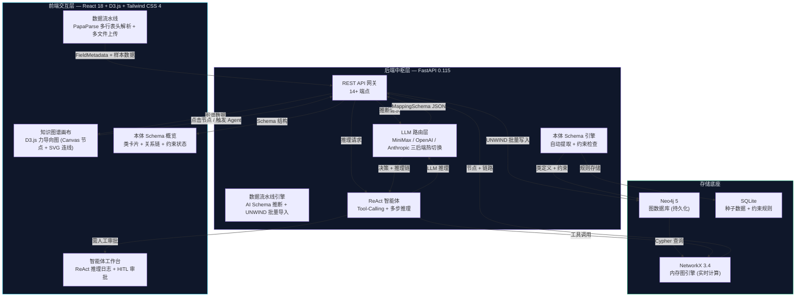

# Ontology OS — 企业本体操作系统

> 一个把企业数据从"表格"变成"活的知识图谱"的技术实验。
> 通过 Vibe Coding（大模型结对编程）逆向工程 Palantir AIP 底层架构的产物。

---

## 一、项目定位与声明

**这是一个 MVP，一个技术沙盒，一个 Proof of Concept。**

代码未必是生产级的。没有测试、没有 CI/CD、没有鉴权层、错误处理是乐观风格。但架构是真的、功能是跑通的、认知是沉淀下来的。

这个项目的初衷很简单：作为一个 AI 产品经理，我想真正理解 Palantir AIP 和 Foundry 的底层逻辑——不是读白皮书那种"大概知道"，而是"我能自己搭一个出来"的那种理解。

整个项目通过 **Vibe Coding** 完成：一个人类定义产品意图、架构边界和设计约束，一个大语言模型（Claude）负责代码生成、调试和迭代。没有传统软件工程师参与，没有 Sprint Planning，没有 Stand-up。只有一个产品经理、一个模型、和两周的疯狂迭代。

**这个项目产出的不是代码，是认知。** 代码只是手段。

如果你是一个产品经理，正在试图理解 Palantir Foundry、AIP 或类似的工业智能体操作系统是如何把"表格"变成"会思考的图谱"的——这个仓库是一份来自刚走完这条路的人的田野笔记。

---

## 二、核心架构大图



**数据流自下而上贯穿**：原始 CSV 文件从浏览器进入，被 PapaParse 解析为富语义的 FieldMetadata（中文字段名、英文 ID、数据类型），发送给 LLM 做语义推断，映射为本体 Schema，通过 UNWIND 批量写入 Neo4j，加载到 NetworkX 内存图，最终渲染为可交互的力导向图谱。Agent 层坐在图谱之上，通过结构化工具调用查询图谱，提出需要人工审批的业务操作建议。

**关键架构决策**：Neo4j 是数据源，NetworkX 是计算引擎，LLM 是推理层。三者解耦——可以独立替换任何一个而不影响其他。

---

## 三、认知演进与复盘

### 阶段一：打破"静态图谱"的幻觉

第一个版本是一个经典的知识图谱 Demo：拖数据进来，渲染一个好看的力导向图，点节点看属性。在 Keynote 里很惊艳，在实际业务中毫无用处。

核心认知：**没有 Action 的图谱只是一张好看的网。**

图谱里的节点不是一个数据点——它是一个带有状态、关系和**动词**的业务实体。Supplier 节点不只有名字和风险等级；它可以被"审计"、被"升级"、被"替换"。库存节点不只是一个数字；当它跌破阈值时，它应该能触发"创建采购订单"的动作。

这引出了**动作系统（Action System）**：每种节点类型都有基于当前状态计算的上下文敏感操作按钮。库存低了？"创建采购订单"按钮亮起。缺陷率高了？"升级到 QA"按钮激活。关键的是，没有任何动作会自动执行——必须经过人工审批。这是直接从 Palantir HITL（Human-in-the-Loop）哲学借鉴的模式。

图谱从"看这个网络"变成了"操作这个业务"。

### 阶段二：理解"Ontology 即 Runtime"

第二个突破发生在我不再把本体当作一个**数据结构**，而是当作一个**运行时环境**的时候。

在传统应用里，数据模型是被动的——它躺在数据库里等着被查询。在本体驱动的系统里，Schema *就是*执行上下文。当 Agent 推理一个问题时，它不是直接查询原始数据——它是**通过本体查询**，本体提供：

- **类型语义**："这是一个 Supplier，这意味着它有这些属性、这些约束、这些关系类型。"
- **推理上下文**："如果 Supplier A 供应 Material B，Material B 被用于 Product C，那么 A 的中断会传播到 C。"
- **动作可能性**："因为这个节点是一个 status='pending' 的 SalesOrder，可用的动作是确认、取消或修改。"

本体不是文档。它是操作系统。Agent 不是"知道"业务逻辑——它是通过遍历 Schema 来**发现**业务逻辑的。这就是一个查询数据库的 Chatbot 和一个基于知识图谱推理的智能体之间的区别。

### 阶段三：打通数据流水线

第三个阶段——也是让这个项目真正有用的阶段——解决了冷启动问题：如何从一堆杂乱的 CSV 文件变成一个可用的知识图谱，而不需要一队数据工程师写 ETL 管道？

答案是 **LLM 结构化推断**。把一张表的元数据（字段名、数据类型、样本行）喂给模型，让它输出一个结构化的 `MappingSchema` JSON，定义：

- 这张表里有哪些实体类型
- 哪列是主键，哪些是属性
- 表与表之间有哪些外键关系
- 这是事实表（订单、库存）还是维度表（产品、客户）

关键的 Prompt Engineering 洞察：**你必须告诉模型，事实表是节点（Node），不是边（Edge）**。一张订单不是客户和产品之间的关系——它本身就是一个独立实体，通过两条边分别关联到客户和产品。搞错这一点，整个图谱拓扑就塌了。

通过多表联合推断（同时分析多张 CSV），系统可以自动发现跨表关系，在一次 LLM 调用中生成完整的本体 Schema。整条管道——从原始 CSV 到可交互的知识图谱——大约 30 秒完成。

---

## 四、技术栈与展望

### 核心技术栈

| 层 | 技术 | 职责 |
|---|------|------|
| 前端框架 | React 18 + Vite 6 | 组件架构、热重载 |
| 样式 | Tailwind CSS 4 | 工具优先的暗黑工业风主题 |
| 图谱渲染 | D3.js (Canvas + SVG 混合) | 力导向布局，5000+ 节点性能优化 |
| CSV 解析 | PapaParse (浏览器端) | 多行表头提取、类型推断 |
| 后端框架 | FastAPI 0.115 | 异步 REST API，14+ 端点 |
| 图数据库 | Neo4j 5 | 持久化图存储、Cypher 查询 |
| 内存图引擎 | NetworkX 3.4 | 路径分析、影响传播、实时图计算 |
| 数据校验 | Pydantic v2 | 请求/响应模型、类型安全 |
| LLM 集成 | MiniMax / OpenAI / Anthropic | ReAct 推理、Schema 推断、Tool Calling |
| 轻量数据库 | SQLite | 种子数据、本体约束规则 |

### 项目目录

```
Prompt to Ontology/
├── README.md                    ← 你正在读的文件
├── .gitignore
├── demo.mp4                     ← 产品演示视频
├── backend/
│   ├── main.py                  ← FastAPI 主入口 (14+ 端点)
│   ├── ontology.py              ← 语义层：NetworkX 图引擎
│   ├── agent.py                 ← 智能体：ReAct 推理入口
│   ├── llm_client.py            ← LLM 路由：三后端热切换
│   ├── data_pipeline.py         ← 数据管道：校验 + 批量导入
│   ├── neo4j_connector.py       ← Neo4j 连接层
│   ├── database.py              ← SQLite 种子数据
│   ├── migrate_to_neo4j.py      ← 数据迁移脚本
│   ├── reset_neo4j.py           ← 清空/重置脚本
│   ├── minimax_client.py        ← MiniMax API 客户端
│   ├── requirements.txt
│   └── .env.example             ← 环境变量模板
├── frontend/
│   ├── package.json
│   ├── vite.config.js
│   ├── index.html
│   └── src/
│       ├── App.jsx              ← 全局状态 + 导航 + 视图路由
│       ├── api.js               ← Axios API 封装
│       ├── index.css            ← 暗黑工业风全局样式
│       └── components/
│           ├── DataPipeline.jsx         ← 多表数据流水线
│           ├── GlobalSchemaMapper.jsx   ← 全局映射校准编辑器
│           ├── D3GraphCanvas.jsx        ← D3 图谱画布
│           ├── OntologySchemaOverview.jsx ← 本体 Schema 概览
│           ├── EntityInspector.jsx      ← 节点 360° 详情面板
│           ├── OntologyBrowser.jsx      ← 本体浏览器
│           ├── AgentWorkshop.jsx        ← Agent 推理日志
│           ├── AgentStudio.jsx          ← 智能体工作台原型
│           ├── ReasoningView.jsx        ← 模型推理原型
│           ├── AnalysisView.jsx         ← 数据分析原型
│           └── LinkTooltip.jsx          ← 链路悬停提示
├── sample-data/                 ← 演示用 CSV 数据集
├── docs/
│   ├── PRD.md                   ← 产品需求文档
│   ├── ARCHITECTURE.md          ← 架构设计文档
│   └── phases/                  ← 开发阶段规划文档
└── CLAUDE.md                    ← Vibe Coding 开发记忆（不上传）
```

### 本地运行

```bash
# 1. 启动 Neo4j（需要 Docker 或本地安装）
docker run -d --name neo4j \
  -p 7474:7474 -p 7687:7687 \
  -e NEO4J_AUTH=neo4j/your_password \
  neo4j:5

# 2. 后端
cd backend
cp .env.example .env             # 填入你的 API Key
pip install -r requirements.txt
python main.py                   # → localhost:8765

# 3. 前端（新终端）
cd frontend
npm install
npm run dev                      # → localhost:5173
```

### 演示视频

项目根目录的 `demo.mp4` 包含完整的产品演示，展示从 CSV 导入到知识图谱生成的全流程。

### Vibe Coding 的收获

构建这个项目是一次产品经理直接接触实现的实验。不是通过传统意义上的"学编程"，而是通过学习**架构思维**——定义边界、指定层间契约、推理数据流——同时让 LLM 处理语法。

最有价值的认知不是关于任何具体技术，而是：**构建本体系统最难的部分不是代码，是心智模型。** 理解图数据库不是本体，本体不是 Schema，Schema 不是数据模型——这些是同心圆的抽象层级，搞对它们是产品问题，不是工程问题。

这个项目让我获得了参与企业 AI 系统架构讨论的词汇和直觉——不是作为一个读文档的人，而是作为一个搭过原型、感受过接缝应该在哪里的人。

---

*Built with Vibe Coding — 一个产品经理、一个模型、和一种执念：产品经理应该理解底层是怎么工作的。*
