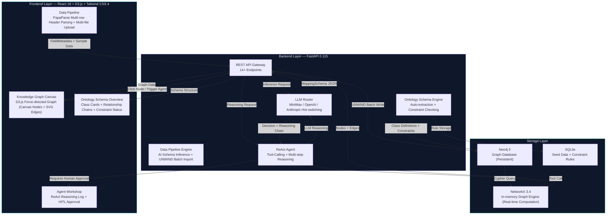

# Ontology OS — Enterprise Ontology Operating System

> A technical experiment that transforms enterprise data from "tables" into "living knowledge graphs"
> A product of reverse-engineering Palantir AIP's underlying architecture through Vibe Coding (LLM pair programming)

[](https://github.com/wenhaoyu-bryan/Prompt-to-Ontology)
[](https://github.com/wenhaoyu-bryan/Prompt-to-Ontology)

**English** | **[中文](README.zh-CN.md)**

---

## 1. Project Positioning & Statement

**This is an MVP, a technical sandbox, a Proof of Concept.**

The code may not be production-grade. There are no tests, no CI/CD, no authentication layer, and error handling is optimistic. But the architecture is real, the features work, and the cognition has been solidified.

The original intention of this project was simple: as an AI Product Manager, I wanted to truly understand the underlying logic of Palantir AIP and Foundry — not the "rough idea" you get from reading whitepapers, but the "I can build one myself" kind of understanding.

The entire project was completed through **Vibe Coding**: a human defines product intent, architecture boundaries, and design constraints, while a large language model (Claude) handles code generation, debugging, and iteration. No traditional software engineers were involved, no Sprint Planning, no Stand-up. Just one product manager, one model, and two weeks of intense iteration.

**What this project produces is not code, but cognition.** Code is just a means.

If you're a product manager trying to understand how Palantir Foundry, AIP, or similar industrial intelligent agent operating systems transform "tables" into "thinking graphs" — this repository is field notes from someone who just walked that path.

---

## 2. Core Architecture Overview



**Data flows from bottom to top**: Raw CSV files enter from the browser, parsed by PapaParse into rich semantic FieldMetadata (Chinese field names, English IDs, data types), sent to LLM for semantic inference, mapped to ontology Schema, batch-written to Neo4j via UNWIND, loaded into NetworkX in-memory graph, and finally rendered as an interactive force-directed graph. The Agent layer sits on top of the graph, queries the graph through structured tool calls, and proposes business operation suggestions that require human approval.

**Key Architecture Decision**: Neo4j is the data source, NetworkX is the compute engine, LLM is the reasoning layer. All three are decoupled — any one can be independently replaced without affecting the others.

---

## 3. Cognitive Evolution & Retrospective

### Phase 1: Breaking the "Static Graph" Illusion

The first version was a classic knowledge graph demo: drag data in, render a beautiful force-directed graph, click nodes to see properties. Stunning in Keynote, utterly useless in real business.

**Core Cognition**: **A graph without Actions is just a pretty picture.**

Nodes in a graph are not data points — they are business entities with state, relationships, and **verbs**. A Supplier node doesn't just have a name and risk level; it can be "audited", "upgraded", "replaced". An inventory node is not just a number; when it drops below a threshold, it should trigger a "Create Purchase Order" action.

This led to the **Action System**: each node type has context-sensitive operation buttons calculated from its current state. Inventory low? "Create Purchase Order" button lights up. Defect rate high? "Escalate to QA" button activates. Crucially, no action executes automatically — it must go through human approval. This pattern was borrowed directly from Palantir's HITL (Human-in-the-Loop) philosophy.

The graph transformed from "view this network" to "operate this business".

### Phase 2: Understanding "Ontology as Runtime"

The second breakthrough occurred when I stopped treating the ontology as a **data structure** and started treating it as a **runtime environment**.

In traditional applications, data models are passive — they sit in databases waiting to be queried. In ontology-driven systems, Schema *is* the execution context. When an Agent reasons about a question, it doesn't directly query raw data — it **queries through the ontology**, which provides:

- **Type Semantics**: "This is a Supplier, meaning it has these attributes, these constraints, these relationship types."
- **Reasoning Context**: "If Supplier A supplies Material B, and Material B is used in Product C, then A's disruption propagates to C."
- **Action Possibilities**: "Because this node is a SalesOrder with status='pending', available actions are confirm, cancel, or modify."

The ontology is not documentation. It's an operating system. The Agent doesn't "know" business logic — it **discovers** business logic by traversing the Schema. This is the difference between a chatbot that queries databases and an intelligent agent that reasons through knowledge graphs.

### Phase 3: Connecting the Data Pipeline

The third phase — and the one that made this project truly useful — solved the cold-start problem: how to go from a pile of messy CSV files to a usable knowledge graph without a team of data engineers writing ETL pipelines?

The answer is **LLM Structured Inference**. Feed a table's metadata (field names, data types, sample rows) to the model, and have it output a structured `MappingSchema` JSON defining:

- What entity types exist in this table
- Which column is the primary key, which are attributes
- What foreign key relationships exist between tables
- Whether this is a fact table (orders, inventory) or dimension table (products, customers)

The key Prompt Engineering insight: **you must tell the model that fact tables are nodes (Nodes), not edges (Edges)**. An order is not a relationship between a customer and a product — it's an independent entity connected to both via separate edges. Get this wrong and your entire graph topology collapses.

Through multi-table joint inference (analyzing multiple CSVs simultaneously), the system can automatically discover cross-table relationships and generate a complete ontology Schema in a single LLM call. The entire pipeline — from raw CSV to interactive knowledge graph — takes approximately 30 seconds.

---

## 4. Tech Stack & Outlook

### Core Tech Stack

| Layer | Technology | Responsibility |
|-------|------------|----------------|
| Frontend Framework | React 18 + Vite 6 | Component Architecture, Hot Reload |
| Styling | Tailwind CSS 4 | Utility-first Dark Industrial Theme |
| Graph Rendering | D3.js (Canvas + SVG Hybrid) | Force-directed Layout, 5000+ Node Performance |
| CSV Parsing | PapaParse (Browser-side) | Multi-row Header Extraction, Type Inference |
| Backend Framework | FastAPI 0.115 | Async REST API, 14+ Endpoints |
| Graph Database | Neo4j 5 | Persistent Graph Storage, Cypher Queries |
| In-memory Graph Engine | NetworkX 3.4 | Path Analysis, Impact Propagation, Real-time Graph Computation |
| Data Validation | Pydantic v2 | Request/Response Models, Type Safety |
| LLM Integration | MiniMax / OpenAI / Anthropic | ReAct Reasoning, Schema Inference, Tool Calling |
| Lightweight Database | SQLite | Seed Data, Ontology Constraint Rules |

### Project Directory

```
Prompt to Ontology/
├── README.md                    # The file you're reading
├── .gitignore
├── demo.mp4                     # Product Demo Video
├── backend/
│   ├── main.py                  # FastAPI Main Entry (14+ Endpoints)
│   ├── ontology.py              # Semantic Layer: NetworkX Graph Engine
│   ├── agent.py                 # Agent: ReAct Reasoning Entry
│   ├── llm_client.py            # LLM Router: 3-backend Hot-switching
│   ├── data_pipeline.py         # Data Pipeline: Validation + Batch Import
│   ├── neo4j_connector.py       # Neo4j Connector
│   ├── database.py              # SQLite Seed Data
│   ├── migrate_to_neo4j.py      # Data Migration Script
│   ├── reset_neo4j.py           # Clear/Reset Script
│   ├── minimax_client.py        # MiniMax API Client
│   ├── requirements.txt
│   └── .env.example             # Environment Variables Template
├── frontend/
│   ├── package.json
│   ├── vite.config.js
│   ├── index.html
│   └── src/
│       ├── App.jsx              # Global State + Navigation + View Routing
│       ├── api.js               # Axios API Wrapper
│       ├── index.css            # Dark Industrial Theme Global Styles
│       └── components/
│           ├── DataPipeline.jsx         # Multi-table Data Pipeline
│           ├── GlobalSchemaMapper.jsx   # Global Schema Mapping Editor
│           ├── D3GraphCanvas.jsx        # D3 Graph Canvas
│           ├── OntologySchemaOverview.jsx # Ontology Schema Overview
│           ├── EntityInspector.jsx      # Node 360° Detail Panel
│           ├── OntologyBrowser.jsx      # Ontology Browser
│           ├── AgentWorkshop.jsx        # Agent Reasoning Log
│           ├── AgentStudio.jsx          # Agent Workshop Prototype
│           ├── ReasoningView.jsx        # Model Reasoning Prototype
│           ├── AnalysisView.jsx         # Data Analysis Prototype
│           └── LinkTooltip.jsx          # Link Hover Tooltip
├── sample-data/                 # Demo CSV Datasets
├── docs/
│   ├── PRD.md                   # Product Requirements Document
│   ├── ARCHITECTURE.md          # Architecture Design Document
│   └── phases/                  # Development Phase Planning Documents
└── CLAUDE.md                    # Vibe Coding Development Memory (not uploaded)
```

### Local Run

```bash
# 1. Start Neo4j (requires Docker or local installation)
docker run -d --name neo4j \
  -p 7474:7474 -p 7687:7687 \
  -e NEO4J_AUTH=neo4j/your_password \
  neo4j:5

# 2. Backend
cd backend
cp .env.example .env             # Fill in your API Key
pip install -r requirements.txt
python main.py                   # → localhost:8765

# 3. Frontend (new terminal)
cd frontend
npm install
npm run dev                      # → localhost:5173
```

### Demo Video

The `demo.mp4` in the project root contains a complete product demo showing the entire flow from CSV import to knowledge graph generation.

### Vibe Coding Gains

Building this project was an experiment in a product manager directly touching implementation. Not through traditional "learning to code", but through learning **architectural thinking** — defining boundaries, specifying layer contracts, reasoning about data flows — while letting the LLM handle syntax.

The most valuable cognition is not about any specific technology, but: **the hardest part of building an ontology system is not the code, but the mental model.** Understanding that a graph database is not an ontology, an ontology is not a schema, and a schema is not a data model — these are concentric circles of abstraction levels, and getting them right is a product problem, not an engineering problem.

This project gave me the vocabulary and intuition to participate in enterprise AI system architecture discussions — not as someone who read documentation, but as someone who built a prototype and felt where the seams should be.

---

*Built with Vibe Coding — one product manager, one model, and an obsession: product managers should understand how the underlying layer works.*

---

## GitHub

**Repository**: [Prompt-to-Ontology](https://github.com/wenhaoyu-bryan/Prompt-to-Ontology)

---

**Last Updated**: 2026-05-18
