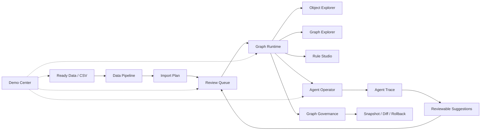

# Prompt-to-Ontology

> A domain-agnostic operational ontology runtime — load data, build graphs, evaluate rules, generate evidence, and operate with an AI agent. Pet Food demo included.

**Status:** Active development · 9 releases · 364+ backend tests

---

## What This Is

Prompt-to-Ontology is a domain-agnostic operational ontology runtime. It ingests structured data (CSV), builds a graph of typed objects and relationships, evaluates rules, generates evidence, and supports AI agent-assisted reasoning — all with human-in-the-loop review at every step.

The Pet Food domain ships as a built-in demo to validate the full pipeline. The same runtime can be pointed at any domain schema — food safety, supply chain, compliance — without changing the engine.

---

## Product Architecture



---

## Feature Matrix

| Feature | Status | Description |
|---|---|---|
| Data Pipeline | ✅ | Profile, map, validate, generate import plans |
| Custom CSV Upload | ✅ | Upload object CSV with type inference |
| Relationship CSV Upload | ✅ | Upload relationship CSV with validation |
| Review Queue | ✅ | Human-in-the-loop approve / reject / apply |
| Graph Runtime | ✅ | Neo4j graph with typed objects and relationships |
| Graph Governance | ✅ | Snapshot, diff, rollback |
| Rule Studio | ✅ | Rule definitions, coverage, simulation |
| Agent Operator | ✅ | AI agent with tool-calling and deterministic fallback |
| Agent Trace & Evaluation | ✅ | Structured traces, 5-score evaluation |
| Demo Center | ✅ | Guided step-by-step demo experience |

---

## Demo

### Guided Demo

Use the built-in Demo Center for a narrated walkthrough:

**Dashboard -> Demo Center -> Start Golden Demo**

### Quick Demo (8 Steps)

1. **Reset** -- Clear all graph data and start fresh
2. **Data Pipeline** -- Profile the sample CSV, review mappings, generate an import plan
3. **Review Queue** -- Review candidates, approve or reject, apply to graph
4. **Object Explorer** -- Browse products, inspect evidence and risk edges
5. **Graph Explorer** -- Explore the local and global evidence network
6. **Rule Studio** -- Review rule definitions, coverage, and run simulations
7. **Agent Operator** -- Ask natural-language questions, propose reviewable updates
8. **Graph Governance** -- Create a snapshot, view diff, test rollback

<!-- TODO: Replace with actual demo video. Place the file at media/demo.mp4 -->
<!--  -->

<!-- TODO: Replace with actual screenshots. Place files in media/ folder. -->
<!--  -->
<!--  -->
<!--  -->
<!--  -->
<!--  -->

---

## Quick Start

### Prerequisites

- Docker (for Neo4j)
- Python 3.10+
- Node.js 18+

### 1. Start Neo4j

```bash
docker run -d --name neo4j-ontology \
  -p 7474:7474 -p 7687:7687 \
  -e NEO4J_AUTH=neo4j/ \
  neo4j:5
```

Neo4j Browser: `http://localhost:7474`

### 2. Start Backend

```bash
cd backend
pip install -r requirements.txt
uvicorn main:app --host 0.0.0.0 --port 8765 --reload
```

Pet food sample data is auto-imported on first startup. Backend runs at `http://localhost:8765`.

### 3. Start Frontend

```bash
cd frontend
npm install
npm run dev
```

Open `http://localhost:5173`.

### Port Summary

| Service | Port |
|---|---|
| Neo4j Browser | `:7474` |
| Neo4j Bolt | `:7687` |
| Backend API | `:8765` |
| Frontend | `:5173` |

---

## LLM Configuration

The Agent Operator works in **deterministic fallback mode** by default -- no API key required.

To enable LLM-powered reasoning:

1. Copy `backend/.env.example` to `backend/.env` and set your API key, **or**
2. Configure at runtime via the UI: **Settings -> LLM Config**

**Supported providers:** OpenAI, Anthropic, DeepSeek, Mimo, MiniMax

> Never commit `.env` files. They are already in `.gitignore`.

---

## Tech Stack

### Frontend

| Layer | Technology |
|---|---|
| Framework | React 18 + Vite 6 |
| Meta-framework | Refine |
| UI Library | Ant Design 6 |
| Routing | React Router v6 |
| i18n | i18next (English + Chinese, 400+ keys) |
| Graph Visualization | D3.js v7 |

### Backend

| Layer | Technology |
|---|---|
| API | FastAPI (Python) |
| Database | Neo4j 5 |
| Graph Algorithms | NetworkX |
| Schema | YAML-based (object types, link types, rules, actions, constraints) |
| Rule Engine | 4-state evaluation (triggered / passed / not_evaluable / not_applicable) |
| Agent | LLM tool-calling with deterministic fallback |

---

## Repository Navigation

```
backend/
  ontology_kernel/     Domain-agnostic runtime
  data_pipeline/       CSV profiling, mapping, import plans
  review_queue/        HITL review workflow
  graph_snapshot/      Snapshot, diff, rollback
  rule_studio/         Rule definitions and simulation
  agent_trace/         Trace and evaluation
  scenario_run/        Guided demo orchestration
frontend/
  pages/               Dashboard, Graph, Agent, Rule Studio, Demo Center, ...
  components/          Layout, navigation
  i18n/                English + Chinese (400+ keys)
docs/                  Product docs, architecture, demo scripts
ontology/pet_food/     Pet Food domain schema (YAML)
sample-data/           Demo CSV data
```

---

## Test Coverage

- Ontology Kernel · Data Pipeline · Review Queue · Agent Operator
- Demo Admin · Build Scenario · Custom CSV · Relationship CSV
- Graph Snapshot · Rule Studio · Agent Trace · Agent Suggestion Quality
- Scenario Run

---

## Roadmap

1. Docker Compose for one-command setup
2. Demo video recording
3. Additional domains (food safety, supply chain, compliance)
4. Schema authoring UI
5. Rule authoring with visual condition builder
6. Agent evaluation benchmark

---

## GitHub About

**Description:**
```
Domain-agnostic operational ontology runtime. Load data, build graphs, evaluate rules, generate evidence, operate with AI. Pet Food demo included.
```

**Topics:** `ontology` `knowledge-graph` `rule-engine` `ai-agent` `human-in-the-loop` `neo4j` `fastapi` `react`

---

## Disclaimer

This demo does not provide veterinary diagnosis. Risk explanations are based only on the current ontology data and demo rules. If data is missing, the system reports that the rule cannot be evaluated rather than claiming the product is safe.

---

## License

MIT
